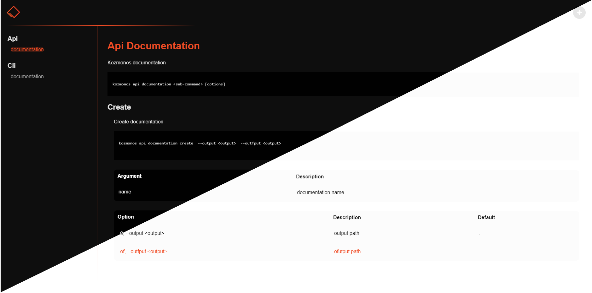

# 🚀 CommanderJS To Documentation

This is a simple tool to generate documentation from your commanderjs commands.



## CommanderJS To Documentation Usage

```js
const commander2documentation = require('@kozmonos/commander2documentation');

//-------------------------------------
// create program

const { Command,program } = require('commander');
const actions = require('./actions');

program
	.description('Kozmonos developer cli tool')
	.version('1.0.0');

program
	.command('test')
	.description('test command')
	.action(actions.test)


const subCommand=new Command('sub')

subCommand
	.command('test2')
	.description('test command 2')
	.option('-o, --out <path>')
	.action(actions.test2)

//-------------------------------------
//program to doc

const app=new commander2documentation(program)
const response=app.build({
	bin: "kozmonos",
	output: "./dist"
})
```
## Support Us

[](https://www.patreon.com/kozmonos)
[](https://www.buymeacoffee.com/kozmonos)
[](https://ko-fi.com/kozmonos)
[](https://liberapay.com/kozmonos/donate)
[](https://github.com/sponsors/Kozmonos)


## Communicate

[](https://t.me/kozmonos)
[](mailto:opensource@kozmonos.com)